# ComEye

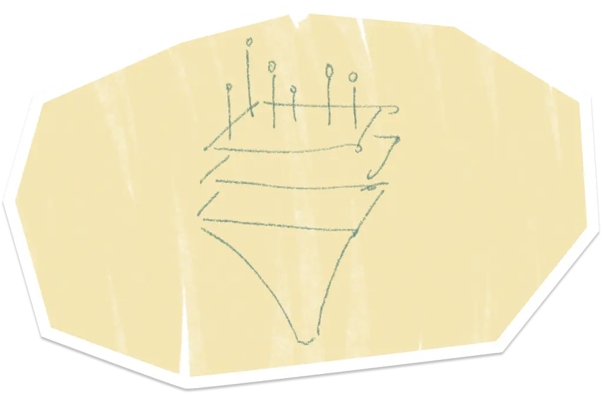

It is one of the [NTU](https://www.ntu.edu.sg/)'s CZ4003 Computer Vision Module Assignment and Project

## What?

We are tasks to do image optimization and/or processing to provide meaningful information or features in return on the given image assets.

## Why?

To apply basic computer vision in image processing on what we have learnt from this module

## How?

1. Assess the possible steps to achieved the required outputs and assumptions
2. Implement the algorithms of each steps and apply them
3. Combine the steps together
4. Fine tune to find the best optimal results
5. Automatized the optimization process

## Highlights

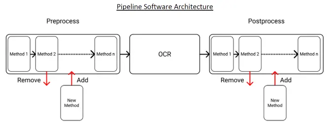

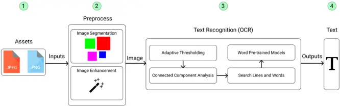

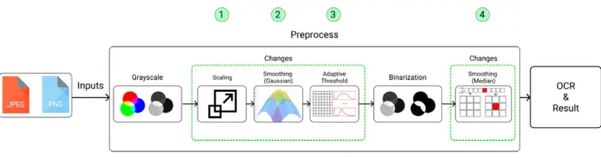

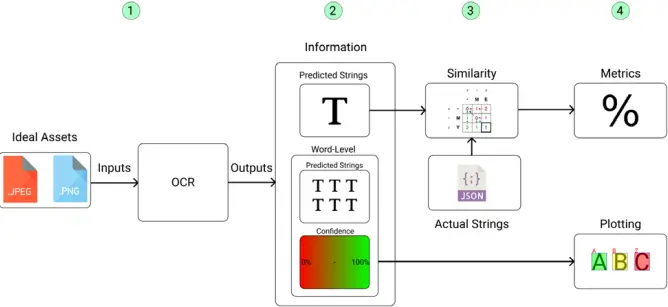

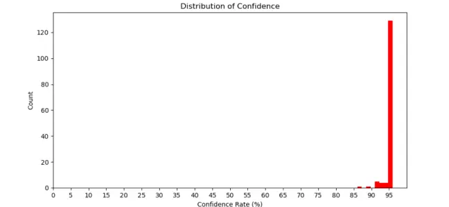

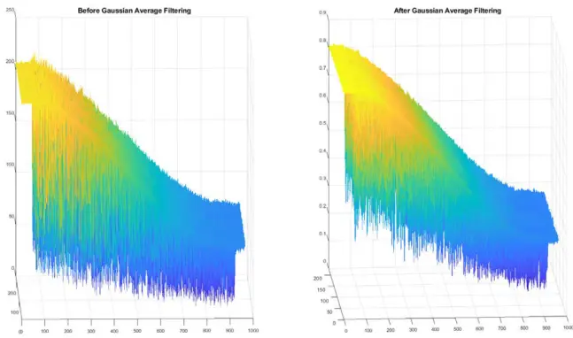

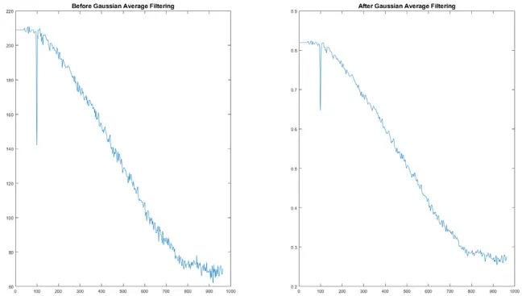

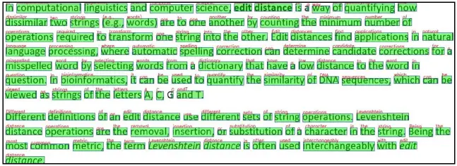

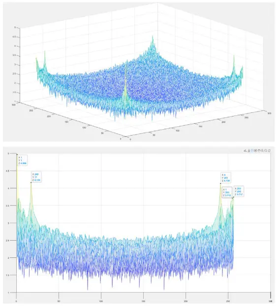

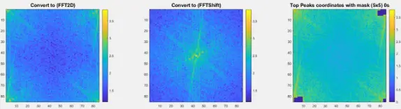

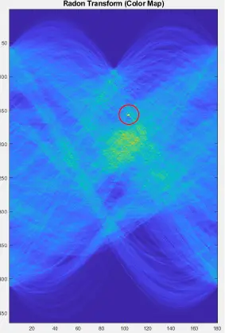

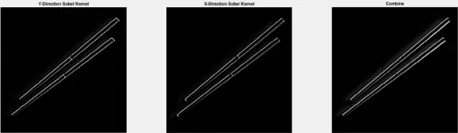

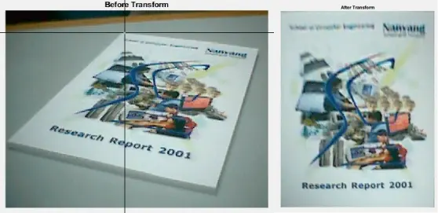

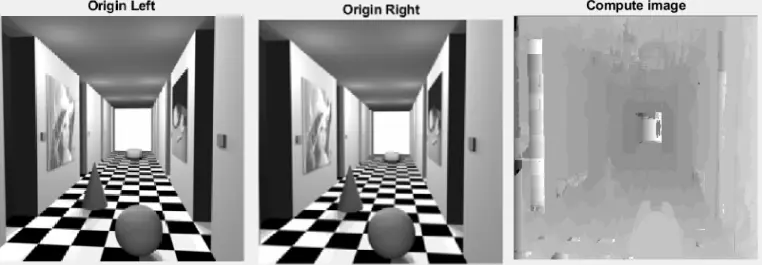

## Disclaimer

All external data and assets in this project used is intended for educational purpose only.

## Contributor

ComEye Team
